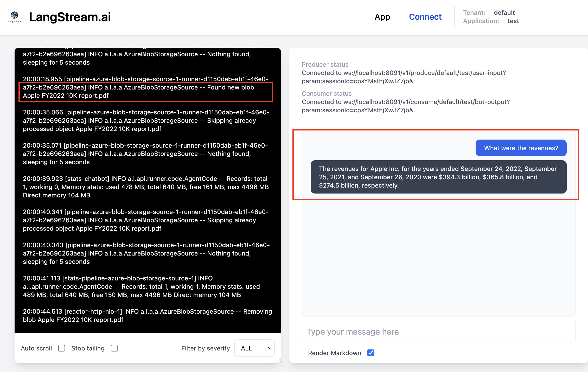

# Real time RAG with LangChain, LangStream, AstraDB, and Azure Blob Storage Ingestion

This sample application demonstrates how to:
- create a continuous PDF document ingestion pipeline using LangStream
- use Retrieval Augmented Generation (RAG) with LangChain to inquire about the contents of the PDFs as they are ingested in real-time. 

It uses our full stack (LangStream, AstraDB, and LangChain) with Azure Blob Storage for PDF ingestion. (Although it uses Azure, you could easily swap out Azure for AWS S3 or GCP Cloud Storage.)

Here is what you will build:



In this demo you will build, the chatbot will be performing RAG on the data ingested by the top pipeline flow. 
### Features:
- Create a Cassandra keyspace and table in AstraDB (if not already created).
- Detect new PDF files uploaded to the specified Azure blob storage container.
- Extract text from the PDFs and chunk the text using a Recursive Character Text Splitter.
- Convert the chunks into a JSON structure.
- Extract information from the filename.
- Generate a vector embedding for the text contents.
- Write the results to the AstraDB table.
- Perform RAG queries in the UI

## Setting Up AstraDB

### Prerequisites:
- A DataStax Astra account. Create one [here](https://astra.datastax.com/register) if you don't already have it.

### Steps:

1. **Login to DataStax Astra:** Navigate to [DataStax Astra](https://astra.datastax.com/) and log in.

2. **Create a New Database:** Go to the `Databases` tab and click `Create Database`.

3. **Configure Your Database:** Provide the required information:
   - Database Name
   - Keyspace Name
   - Cloud Provider (Choose **Azure** for this guide)
   - Region
Be sure to select Vector Database as the type at the top. 

4. **Database Initialization:** Wait for your database to be ready. Check status on the dashboard.

5. **Connection:** Once ready, click `Connect` for connection details.


6. **Token Generation:** Click "create a custom token" (or navigate to `Settings` -> `Tokens`) in the Astra DB console. Select the required permissions. For this tutorial, we will use Database Administrator as the role. 
Click `Generate Token`. Save the generated credentials securely. You will not be able to retrieve them again.

Note: For a more detailed guide on creating your DB, check the [AstraDB setup guide](https://docs.datastax.com/en/astra-serverless/docs/manage/db/manage-create.html).

## Creating an Azure Blob Storage Container

### Prerequisites:
- An active Azure account. Get a [free account](https://azure.com/free) if needed.
- Azure Storage account. Here's a [guide](https://docs.microsoft.com/azure/storage/common/storage-account-create).

### Steps:

1. **Login to Azure Portal:** Go to [Azure Portal](https://portal.azure.com/).

2. **Navigate to Storage Account:** Click "Storage accounts" then your storage account name.

3. **Create a Blob Container:** Go to `Blob service` -> `Containers`, then click `+ Container` and configure it.

## Deploy Dependencies Using Terraform

### Generate SSH Key Pair using Azure

1. **Login to Azure CLI:**  
   First, ensure you have the Azure CLI installed. If not, download and install it from [here](https://docs.microsoft.com/en-us/cli/azure/install-azure-cli). Once installed, run the following command to login:
```bash
az login
```

2. **Generate SSH Key Pair:**  
   Use the following command to generate an SSH key pair. This command creates both the public and private key files:
```bash
az sshkey create --name azure --output-folder ~/.ssh
```
Replace \`azure\` with your desired key name. This command creates \`azure\` (private key) and \`azure.pub\` (public key) in the `~/.ssh` directory.

## Setting Up Secrets

### Update Secrets file:
Ensure you protect your secrets and never upload them to source control. Update the [secrets file](../../secrets/secrets.yaml) for this tutorial or the secrets section of the [Terraform script](deployment.tf) based on your deployment method.

### Sample secrets.yaml:

```
secrets:
  - id: open-ai
    data:
      access-key: "mykey"
      url: "https://mydomain.openai.azure.com"
      embeddings-model: "text-embedding-ada-002"
      provider: "azure"
  - id: astra
    data:
      token: "AstraCS:mytoken"
      database: "exampledb"
      environment: "prod"
      keyspace: "examplekeyspace"
      table: "exampletable"
  - id: azure
    data:
      storage-access-key: "examplekey"
      storage-account-name: "exampleaccount"
      container: "examplecontainer"
  - id: astra-langchain
    data:
      token: "AstraCS:mytoken"
      database-id: "astra-db-uuid"
      database: "exampledb"
      keyspace: "examplekeyspace"
      table: "exampletable"
      clientId: "exampleClientId"
      secret: "exampleSecret"
```

If using Terraform, update the [Terraform deployment script](deployment.tf) as needed.

## Run the Flow Locally

1. **Install LangStream:** Follow the [installation guide](https://github.com/LangStream/langstream#installation).
   
2. **Start the Pipeline:** Ensure your secrets file is ready.

Warning: LangStream performs a destructive operation when consuming files from your blob storage container. Ensure that it's safe for the files in the storage container to be deleted after being successfully ingested!

. Then run:

```
cd examples/applications/azure-document-ingestion
langstream docker run test -app . -s ../../secrets/secrets.yaml
```
Wait for the UI to start and the logs to reach the state of "Nothing found".
(Alternatively, if you have already put documents in your blob storage container, then you will see logs as LangStream processes the files.)

Any new PDFs added to the Azure blob storage container will be processed and saved in AstraDB, then deleted from the blob container.

### Deploy PDFs for LangStream
**Upload PDFs to Azure container:** For this tutorial, files will be mapped to our target table with the convention: `"${productName} ${productVersion}.pdf"` (e.g., "appleWatch 7.12-v4.pdf" will set productName as appleWatch and productVersion as 7.12-v4).

**Upload PDFs**
You can now upload PDFs to your Azure storage container to get them processed. As a reminder, the PDFs we used for this demo assume a naming convention starting with product-name version-name and then any other details, like "MyProduct DocVersion2 public report.pdf". 

Then, click Upload:

**Check results**
To inspect the results, navigate to the CQL Console in the Astra UI and run:
```SQL
SELECT * FROM mykeyspace.mytable limit 2;
```
where mykeyspace and mytable are the keyspace and table used in your secrets.yaml file.

You should now see vectorized data in your table!

## Test RAG
The moment of truth - executing a Retrieval Augmented Generation (RAG) query that leverages your PDF data.
### Connect via LangStream UI
Return to the LangStream UI and click Connect.

### Ask a question
Ask a question that can only be answered by the PDF(s) you uploaded.
After you have asked your question, press enter.


## View flow (for fun)
If you click the App tab, you can see a visual representation of your pipeline. Pretty cool, huh!


### Deploy with Kubernetes
The best way to deploy this stack in production is with kubernetes via Helm.
You can do this by following the [instructions for deploying LangStream on Kubernetes](https://docs.langstream.ai/installation/kubernetes)

### Deploy with minikube
You can also deploy via Minikube. We have a [helper utility](https://github.com/LangStream/langstream#local-deployment) to simplify getting it working. 

### Run Terraform to deploy dependencies
1. Review [this Terraform deployment script](deployment.tf).

2. **Initialize Terraform:**
```bash
cd examples/applications/azure-document-ingestion
terraform init
```

3. **Validate Terraform Configuration:**
```bash
terraform validate
```

4. **Plan Terraform Deployment:**
```bash
terraform plan
```
5. **Apply Terraform Deployment:**
```bash
terraform apply
```
or to auto-approve:
```bash
terraform apply -auto-approve
```
6. **Connect to the VM as needed to check that service is running as expected**
```bash
chmod 600 /Users/`whoami`/.ssh/azure.pem
ssh -i ~/.ssh/azure.pem adminuser@40.83.57.12 # substitute with the actual VM IP
```
7. **Verify service is running**
```bash
systemctl status myapp.service
```
If it's not, you can troubleshoot by running the command directly and inspecting the output, like:
```bash
sudo su -
runuser -l adminuser -c '/home/adminuser/.langstream/candidates/current/bin/langstream docker run test -app /home/adminuser/app -s /home/adminuser/secrets.yaml'
```
Additionally, you can check the cloud init output log on the VM to ensure the Terraform deployment ran correctly
```bash
cat /var/log/cloud-init-output.log
```
