# Running your own Chat bot using docker

This sample application shows how to build a chat bot over the content of a website.
In this case you are going to crawl the LangStream.ai documentation website.

The Chat bot will be able to help you with LangStream.

In this example we are using [HerdDB](ps://github.com/diennea/herddb) as a vector database using the JDBC driver,
but you can use any Vector databases.


## Configure you OpenAI API Key

Export to the ENV the access key to OpenAI

```
export OPEN_AI_ACCESS_KEY=...
```

The default [secrets file](../../secrets/secrets.yaml) reads from the ENV. Check out the file to learn more about
the default settings, you can change them by exporting other ENV variables.

## Deploy the LangStream application in docker

The default docker runner starts Minio, Kafka and HerdDB, so you can run the application locally.

```
./bin/langstream docker run test -app examples/applications/docker-chatbot -s examples/secrets/secrets.yaml
```


## Talk with the Chat bot using the CLI
Since the application opens a gateway, we can use the gateway API to send and consume messages.

```
./bin/langstream gateway chat test -cg bot-output -pg user-input -p sessionId=$(uuidgen)
```

Responses are streamed to the output-topic. If you want to inspect the history of the raw answers you can
consume from the log-topic using the llm-debug gateway:

```
./bin/langstream gateway consume test llm-debug
```

## Application flow chart

```mermaid
flowchart TB

  subgraph JdbcDatasource["<b>⛁ JdbcDatasource</b>"]
    documents
  end

  subgraph streaming-cluster["<b>✉️ streaming cluster</b>"]
    questions-topic
    answers-topic
    log-topic
    chunks-topic
  end

  subgraph gateways["<b>gateways</b>"]
    user-input --> questions-topic
    answers-topic --> bot-output
    log-topic --> llm-debug
  end

  subgraph chatbot["<b>chatbot</b>"]
    A("convert-to-structure<br><i>document-to-json</i>") --> B
    B("compute-embeddings<br><i>compute-ai-embeddings</i>") --> C
    C("lookup-related-documents<br><i>query-vector-db</i>") --> D
    D("re-rank documents with MMR<br><i>re-rank</i>") --> E
    E("ai-chat-completions<br><i>ai-chat-completions</i>") --> F
    F("cleanup-response<br><i>drop-fields</i>")
  end
  questions-topic --> A
  JdbcDatasource --> C
  E --> answers-topic
  F --> log-topic

  subgraph crawler["<b>crawler</b>"]
    G("Crawl the WebSite<br><i>webcrawler-source</i>") --> H
    H("Extract text<br><i>text-extractor</i>") --> I
    I("Normalise text<br><i>text-normaliser</i>") --> J
    J("Detect language<br><i>language-detector</i>") --> K
    K("Split into chunks<br><i>text-splitter</i>") --> L
    L("Convert to structured data<br><i>document-to-json</i>") --> M
    M("prepare-structure<br><i>compute</i>") --> N
    N("compute-embeddings<br><i>compute-ai-embeddings</i>")
    O("Write<br><i>vector-db-sink</i>")
  end
  P["🌐 web site"] --> G
  N --> chunks-topic
  chunks-topic --> O
  O --> documents
```


