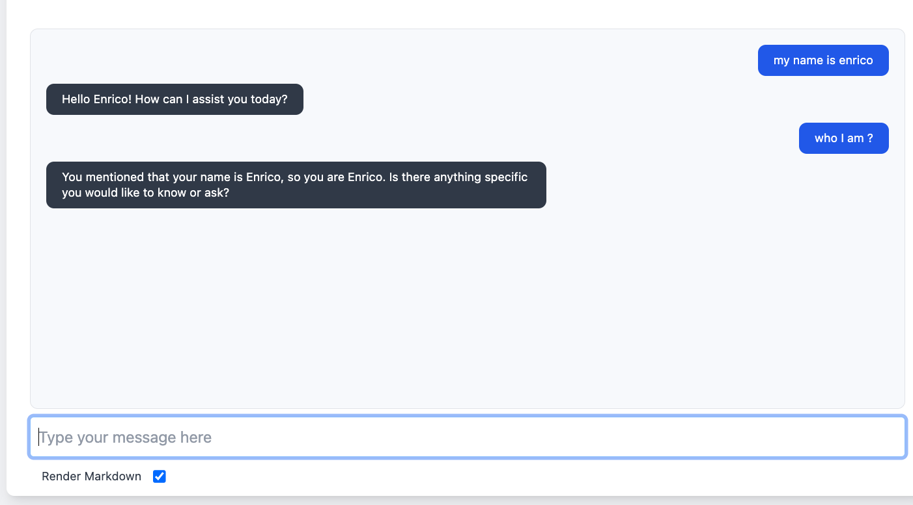

# Implementing a Chat bot with History using a PostGreSQL Database

This sample application shows how to perform queries against a JDBC database using the PostGre JDBC driver.


## Prerequisites


Start PostGreSQL using docker

```
docker run -p 5432:5432  -d -e POSTGRES_PASSWORD=password ankane/pgvector
```

## Configure you OpenAI API Key

Export to the ENV the access key to OpenAI

```
export OPEN_AI_ACCESS_KEY=...
```

The default [secrets file](../../secrets/secrets.yaml) reads from the ENV. Check out the file to learn more about
the default settings, you can change them by exporting other ENV variables.

## Deploy the LangStream application

When LangStream deploys the application it automatically creates a database table named "chat_history". 

```
./bin/langstream docekr run  test -app examples/applications/query-postgresql-chat-history -s examples/secrets/secrets.yaml
```

## Talk with the Chat bot using the UI
Since the application opens a gateway, we can use the development UI to send and consume messages.

```
User: My name is John
Answer:  Hello John, how can I help you?

User: Who am I ?
Answer: You are John
```

